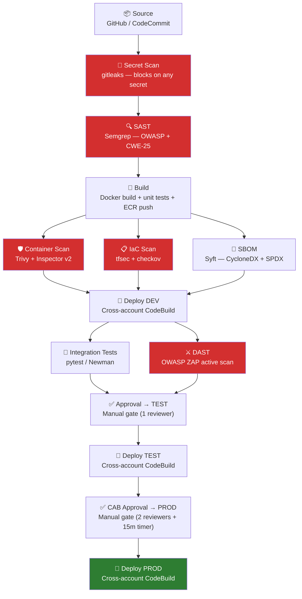
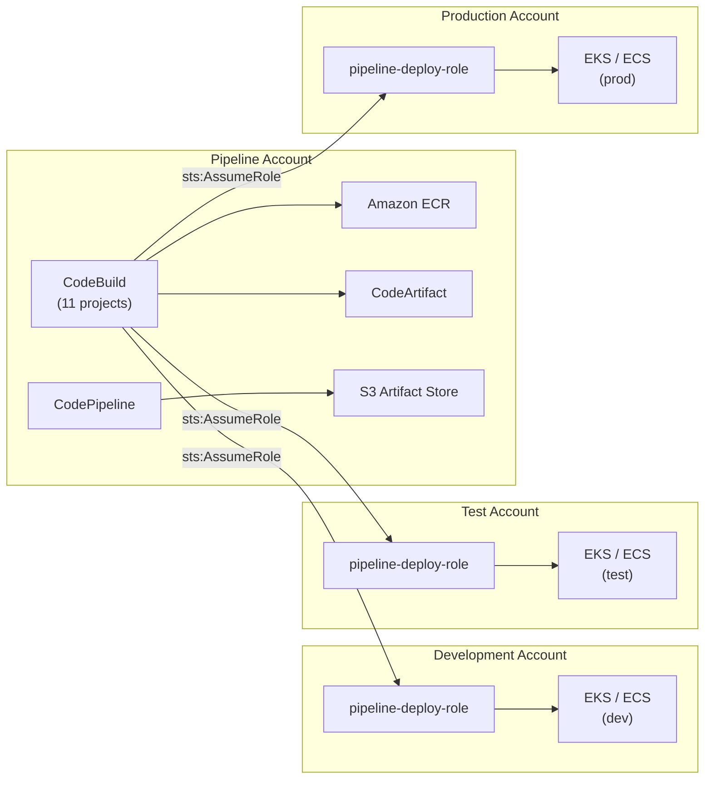
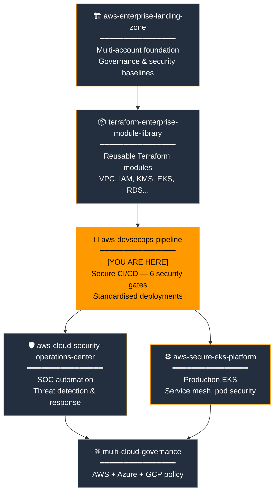
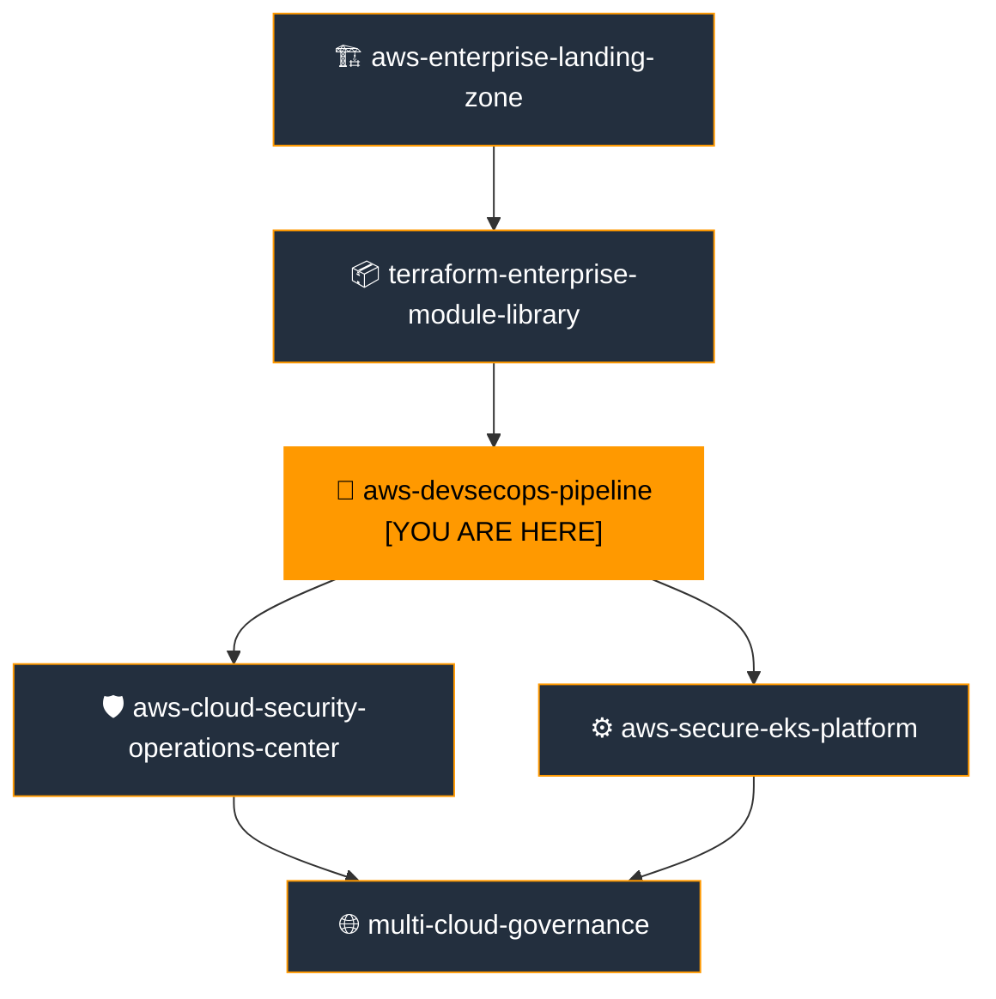

# AWS DevSecOps Pipeline

[](https://github.com/e-mulenga/aws-devsecops-pipeline/actions)
[](https://github.com/e-mulenga/aws-devsecops-pipeline/actions)
[](LICENSE)
[](https://www.terraform.io)
[](https://registry.terraform.io/providers/hashicorp/aws)

> **Portfolio Position 3 of 6** — Enterprise Cloud Platform
> Secure, multi-stage CI/CD pipeline with embedded security gates — blocking vulnerabilities before they reach production.

---

## Table of Contents

1. [Executive Summary](#1-executive-summary)
2. [Business Problem](#2-business-problem)
3. [Solution Overview](#3-solution-overview)
4. [Architecture Overview](#4-architecture-overview)
5. [Enterprise Cloud Portfolio Position](#5-enterprise-cloud-portfolio-position)
6. [AWS Services Used](#6-aws-services-used)
7. [Service Selection Rationale](#7-service-selection-rationale)
8. [Terraform Structure](#8-terraform-structure)
9. [Deployment Guide](#9-deployment-guide)
10. [Validation Guide](#10-validation-guide)
11. [Security Controls](#11-security-controls)
12. [Monitoring & Observability](#12-monitoring--observability)
13. [Disaster Recovery Strategy](#13-disaster-recovery-strategy)
14. [Cost Optimization Strategy](#14-cost-optimization-strategy)
15. [Operational Runbooks](#15-operational-runbooks)
16. [AWS Well-Architected Review](#16-aws-well-architected-review)
17. [Skills Demonstrated](#17-skills-demonstrated)
18. [Interview Talking Points](#18-interview-talking-points)
19. [Future Enhancements](#19-future-enhancements)
20. [Related Repositories](#20-related-repositories)

---

## 1. Executive Summary

This repository delivers a **production-grade, security-first CI/CD pipeline** built on AWS CodePipeline and CodeBuild, with eleven distinct stages — six of which are dedicated security gates. Every commit to the main branch triggers an automated sequence that detects secrets, runs SAST, builds and scans container images, generates an SBOM, performs DAST, and deploys progressively through dev, test, and production with mandatory human approval gates.

Built as **position 3 of 6** in the Enterprise Cloud Platform Portfolio, this pipeline sits on the account structure established by the [AWS Enterprise Landing Zone](https://github.com/your-org/aws-enterprise-landing-zone-terraform) and uses reusable modules from the [Terraform Enterprise Module Library](https://github.com/your-org/terraform-enterprise-module-library). Its outputs — standardised deployments, container images, and Security Hub findings — are consumed directly by the [Cloud Security Operations Centre](https://github.com/your-org/aws-cloud-security-operations-center) and the [Secure EKS Platform](https://github.com/your-org/aws-secure-eks-platform).

**Key outcomes:**
- Zero-touch promotion from commit to production with six automated security gates
- Secrets detected before they reach a branch; credentials never stored in pipeline infrastructure
- Container image immutability enforced in production (ECR tag immutability)
- SBOM generated per deployment for supply chain compliance
- All security findings imported to Security Hub in ASFF format

---

## 2. Business Problem

### The Challenge

| Problem | Business Impact |
|---|---|
| Manual deployments | Human error, inconsistent releases, slow time-to-market |
| Security tested only at end of SDLC | Vulnerabilities found late are 10–100× more expensive to fix |
| Secrets committed to repositories | Credential compromise, data breach, regulatory breach |
| No container vulnerability scanning | CVEs in base images shipped to production undetected |
| No SBOM | Cannot assess blast radius when a zero-day CVE is published |
| Ad-hoc deployments across accounts | No audit trail, no blast-radius control, no approval evidence |
| Dependency confusion attacks | Malicious packages pulled directly from public registries |

### Regulatory & Compliance Pressure

- **US Executive Order 14028** — Requires SBOM for federal software supply chains
- **EU Cyber Resilience Act** — Mandates vulnerability disclosure and SBOM
- **PCI-DSS 4.0 §6.3** — Requires vulnerability management in the SDLC
- **ISO 27001 A.14** — Secure development lifecycle controls
- **OWASP SAMM** — Software Assurance Maturity Model pipeline requirements

---

## 3. Solution Overview

### Pipeline Architecture

A single CodePipeline with eleven stages executes on every merge to `main`:

```
Source → [SecretScan + SAST] → Build → [ContainerScan + IaCScan + SBOM]
  → DeployDev → [IntegrationTest + DAST] → [Approval] → DeployTest
  → [CAB Approval] → DeployProd
```

### Security Gates Summary

| Stage | Tool | Blocks On |
|---|---|---|
| SecretScan | gitleaks v8 | Any secret pattern match |
| SAST | Semgrep (OWASP + CWE-25) | HIGH/CRITICAL findings (configurable) |
| ContainerScan | Trivy + Inspector v2 | CVEs ≥ threshold (default: HIGH) |
| IaCScan | tfsec + checkov | HIGH/CRITICAL misconfigurations |
| SBOM | Syft (CycloneDX + SPDX) | Never blocks — generates audit artefact |
| DAST | OWASP ZAP | HIGH/CRITICAL risk alerts |

### What This Repository Provisions

- **CodePipeline** — 10-stage orchestrator with approval gates
- **11 CodeBuild projects** — one per pipeline stage, isolated and auditable
- **ECR repositories** — KMS-encrypted, tag-immutable in prod, Inspector-scanned
- **CodeArtifact** — private package proxy (npm, pip, maven)
- **S3 artifact store** — KMS-encrypted, versioned, TLS-only
- **IAM roles** — least-privilege CodePipeline and CodeBuild roles
- **Cross-account deployment roles** — scoped assume-role for dev/test/prod
- **SNS topics** — alert and approval notifications
- **Lambda Slack notifier** — optional Slack webhook delivery
- **EventBridge rules** — pipeline state and security gate events → SNS
- **CloudWatch dashboard** — pipeline executions, build duration, gate failures

---

## 4. Architecture Overview

### Pipeline Stage Flow



### Multi-Account Deployment Model



---

## 5. Enterprise Cloud Portfolio Position



### Portfolio Position Detail

| Attribute | Value |
|---|---|
| **Position** | 3 of 6 — Delivery Layer |
| **Type** | CI/CD Pipeline & Security Automation |
| **Deploy after** | aws-enterprise-landing-zone, terraform-enterprise-module-library |

**Depends on (must be deployed first):**
- `aws-enterprise-landing-zone` — account IDs, KMS key ARNs, IAM Identity Center
- `terraform-enterprise-module-library` — VPC, IAM, KMS, S3 modules

**This repository produces:**
- Validated, security-scanned container images in ECR
- SBOM artefacts per deployment (CycloneDX + SPDX)
- Security findings in Security Hub (ASFF format)
- Standardised cross-account deployment mechanism
- Pipeline alerts SNS topic ARN

**Consumed by:**
- `aws-cloud-security-operations-center` — ingests Security Hub findings, pipeline alerts
- `aws-secure-eks-platform` — receives container images from ECR; uses the deployment mechanism

---

## 6. AWS Services Used

| Service | Role in Pipeline | Stage |
|---|---|---|
| AWS CodePipeline | Pipeline orchestration, stage sequencing, approval gates | All |
| AWS CodeBuild | Execution environment for all 11 build/scan/deploy stages | All |
| Amazon ECR | Private container registry with Inspector scanning | Build, Deploy |
| AWS CodeArtifact | Private package proxy (npm, pip, maven) | Build |
| Amazon S3 | Artifact store, build logs, SBOM archive | All |
| AWS KMS | Artifact encryption, ECR encryption, CodeArtifact domain | All |
| AWS IAM | CodePipeline role, CodeBuild role, cross-account deploy roles | All |
| AWS Secrets Manager | Runtime secrets injection into CodeBuild | Build, Deploy |
| AWS Systems Manager | Configuration parameters for target environments | Deploy |
| Amazon Inspector v2 | Continuous container image vulnerability scanning | Post-build |
| AWS Security Hub | Finding aggregation (ASFF import from all scanners) | All security stages |
| Amazon SNS | Pipeline alerts and approval notifications | All |
| Amazon EventBridge | Pipeline state → SNS routing | All |
| AWS Lambda | Optional Slack notification delivery | Notifications |
| Amazon CloudWatch | Pipeline metrics, build logs, security dashboard | All |
| AWS CodeStar Connections | GitHub OAuth integration | Source |

**Third-party open-source tools (run in CodeBuild):**

| Tool | Purpose | Stage |
|---|---|---|
| gitleaks v8 | Secrets detection | SecretScan |
| Semgrep | SAST (OWASP, CWE-25, security-audit) | SAST |
| Trivy | Container + filesystem + IaC vulnerability scan | ContainerScan |
| tfsec | Terraform IaC security scan | IaCScan |
| checkov | Multi-framework IaC scan | IaCScan |
| Syft (Anchore) | SBOM generation (CycloneDX + SPDX) | SBOM |
| OWASP ZAP | Dynamic Application Security Testing | DAST |

---

## 7. Service Selection Rationale

Full rationale for every service is in [`architecture/service-selection-rationale.md`](architecture/service-selection-rationale.md).

### Summary Table

| Service | Selected Over | Key Reason |
|---|---|---|
| CodePipeline | Jenkins, GitHub Actions (full) | Native AWS integration, cross-account IAM, no self-management |
| CodeBuild | EC2 Jenkins agents | Serverless, ephemeral, zero idle cost |
| ECR | Docker Hub, JFrog | Inspector v2 continuous scanning, tag immutability, native IAM |
| CodeArtifact | Nexus, direct internet | Supply chain attack prevention, package caching, no EC2 |
| Inspector v2 | One-time Trivy scan | Continuous post-push scanning (new CVEs detected without re-run) |
| Semgrep | CodeGuru, SonarQube | Open-source, all languages, OWASP rulesets, SARIF output |
| Trivy | Clair, Snyk | Single tool for images + IaC + filesystems; open-source |
| Syft | Commercial SBOM tools | Open-source, CycloneDX + SPDX, integrates with Grype for analysis |
| OWASP ZAP | Burp Suite Enterprise | Open-source, Docker-native, no licensing cost |

---

## 8. Terraform Structure

```
aws-devsecops-pipeline/
├── provider.tf                        # terraform{} block + all providers (NO versions.tf)
├── variables.tf                       # 35+ validated variables — nothing hardcoded
├── main.tf                            # Root: composes all 7 modules + CloudWatch resources
├── outputs.tf                         # Pipeline ARN, ECR URLs, SNS ARNs → downstream repos
├── terraform.tfvars.example           # Template — NEVER commit terraform.tfvars
│
├── modules/
│   ├── pipeline-iam/                  # CodePipeline + CodeBuild roles, cross-account trust
│   ├── artifact-store/                # Encrypted S3 artifact bucket + CloudWatch log group
│   ├── ecr/                           # ECR repositories, lifecycle policies, cross-account pull
│   ├── codeartifact/                  # Domain, npm/pip/maven upstreams, internal repo
│   ├── codebuild/                     # 11 projects via for_each — secret-scan through deploy-prod
│   ├── notifications/                 # SNS topics, EventBridge rules, Lambda Slack notifier
│   └── codepipeline/                  # 10-stage pipeline with conditional security gates
│
├── buildspecs/
│   ├── buildspec-secret-scan.yml      # gitleaks — blocks on secrets
│   ├── buildspec-sast.yml             # Semgrep OWASP + CWE-25 + Bandit
│   ├── buildspec-build.yml            # Docker build + unit tests + ECR push
│   ├── buildspec-container-scan.yml   # Trivy image + filesystem scan
│   ├── buildspec-iac-scan.yml         # tfsec + checkov
│   ├── buildspec-sbom.yml             # Syft CycloneDX + SPDX generation
│   ├── buildspec-integration-test.yml # pytest + Newman cross-account
│   └── buildspec-dast.yml             # OWASP ZAP active scan
│   └── buildspec-deploy.yml           # Cross-account kubectl/ECS deploy (shared)
│
├── environments/
│   ├── dev/   { backend.tf, terraform.tfvars.example }
│   ├── test/  { backend.tf, terraform.tfvars.example }
│   └── prod/  { backend.tf, terraform.tfvars.example }
│
├── .github/workflows/
│   ├── terraform-plan.yml             # PR gate: OIDC, tfsec, checkov, plan per env
│   ├── terraform-apply.yml            # Apply: dev auto, test/prod gated + drift detection
│   └── security-scan.yml             # Daily: tfsec + checkov + trivy + gitleaks + tflint
│
├── policies/iam/
│   └── pipeline-deployment-role.json  # Cross-account deploy role (apply in each target account)
│
├── architecture/
│   └── service-selection-rationale.md # Full service justification for every tool
│
├── runbooks/
│   ├── pipeline-failure-runbook.md    # 6 failure scenarios with CLI remediation steps
│   └── operational-runbook.md         # Day-2 ops, gate management, maintenance schedule
│
├── validation/
│   └── validate-pipeline.sh           # Post-deploy: checks all 11 projects + ECR + SNS
│
├── scripts/
│   ├── bootstrap-state.sh             # S3 + DynamoDB + KMS remote state bootstrap
│   └── setup-github-connection.sh     # CodeStar connection creation helper
│
├── .gitignore
├── CONTRIBUTING.md
├── SECURITY.md
└── README.md
```

### Module Design Decisions

- **`codebuild` module uses `for_each` over `local.projects` map** — 11 projects defined declaratively; adding a new stage is one map entry.
- **Buildspecs are external files** — committed to the repository and read at runtime. Changes take effect on the next pipeline run without Terraform apply.
- **No `versions.tf`** — portfolio standard: `terraform {}` block lives in `provider.tf`.
- **All values are variables** — no hardcoded account IDs, regions, emails, or secrets.
- **Conditional stages** — `sast_enabled`, `dast_enabled`, `sbom_enabled`, `iac_scan_enabled` toggle stages without removing CodeBuild projects.

---

## 9. Deployment Guide

### Prerequisites

| Tool | Version | Purpose |
|---|---|---|
| Terraform | ≥ 1.6.0 | IaC |
| AWS CLI | ≥ 2.15 | Bootstrap + validation |
| jq + python3 | Any | Scripts |

**Deploy order:** Landing Zone → Module Library → **This repo**

### Step 1 — Bootstrap Remote State

```bash
ENV=prod ORG=acme-enterprise AWS_REGION=af-south-1 \
  bash scripts/bootstrap-state.sh
# Update environments/prod/backend.tf with output values
```

### Step 2 — Create GitHub CodeStar Connection

```bash
REGION=af-south-1 CONNECTION_NAME=github-prod \
  bash scripts/setup-github-connection.sh
# Complete OAuth in AWS Console, then add ARN to terraform.tfvars
```

### Step 3 — Configure Variables

```bash
cp terraform.tfvars.example environments/prod/terraform.tfvars
# Populate with:
#   - Account IDs from landing zone: terraform output -json
#   - KMS key ARN from landing zone: terraform output kms_cloudtrail_key_arn
#   - GitHub connection ARN from step 2
```

### Step 4 — Set Up OIDC for GitHub Actions

```bash
# From the landing zone scripts (already created)
GITHUB_ORG=your-org GITHUB_REPO=aws-devsecops-pipeline \
ENV=prod AWS_ACCOUNT_ID=<pipeline_account_id> \
  bash ../aws-enterprise-landing-zone-terraform/scripts/setup-oidc.sh
```

### Step 5 — Apply Cross-Account Deployment Roles

Apply `policies/iam/pipeline-deployment-role.json` as an IAM policy in **each target account** (dev, test, prod), attached to a role named `<org>-pipeline-deploy-role` with a trust policy allowing the pipeline account's CodeBuild role to assume it.

### Step 6 — Deploy Pipeline Infrastructure

```bash
# Phase 1 — IAM roles first (other modules depend on role ARNs)
terraform init -backend-config="environments/prod/backend.tf" -reconfigure
terraform apply \
  -var-file="environments/prod/terraform.tfvars" \
  -target=module.pipeline_iam \
  -target=module.artifact_store

# Phase 2 — Full apply
terraform apply -var-file="environments/prod/terraform.tfvars"
```

### Step 7 — Validate

```bash
ENV=prod ORG=acme-enterprise AWS_REGION=af-south-1 \
  bash validation/validate-pipeline.sh
```

---

## 10. Validation Guide

### Automated Validation

```bash
ENV=prod ORG=acme-enterprise AWS_REGION=af-south-1 \
  bash validation/validate-pipeline.sh
# Checks: pipeline exists, 11 CodeBuild projects, ECR repos,
# SNS topics, S3 encryption, CloudWatch alarms
```

### Manual Spot Checks

**Trigger a test pipeline run:**
```bash
aws codepipeline start-pipeline-execution \
  --name "acme-enterprise-prod-devsecops-pipeline" --region af-south-1
```

**Verify ECR tag immutability (prod):**
```bash
aws ecr describe-repositories \
  --repository-names "acme-enterprise-prod-app" \
  --query 'repositories[0].imageTagMutability' --region af-south-1
# Expected: IMMUTABLE
```

**Verify CodeArtifact blocks direct internet (test pull):**
```bash
aws codeartifact get-authorization-token \
  --domain "acme-enterprise-prod" \
  --query authorizationToken --output text --region af-south-1
```

**Verify cross-account role assumption:**
```bash
aws sts assume-role \
  --role-arn "arn:aws:iam::<DEV_ACCOUNT_ID>:role/acme-enterprise-pipeline-deploy-role" \
  --role-session-name "validation-test"
```

---

## 11. Security Controls

### Identity & Access

| Control | Implementation |
|---|---|
| No long-lived AWS keys | GitHub Actions uses OIDC; CodeBuild uses IAM role |
| Least-privilege pipeline role | Custom IAM policy — only required CodePipeline actions |
| Least-privilege build role | Custom IAM policy — scoped to ECR, S3, Secrets Manager |
| Cross-account deployment | Explicit assume-role — no wildcard trust |
| No root account usage | Enforced by Landing Zone SCP |
| Build isolation | Each CodeBuild project runs in ephemeral, isolated container |

### Data Protection

| Control | Implementation |
|---|---|
| Artifact encryption | S3 KMS CMK (from Landing Zone), bucket key enabled |
| ECR encryption | KMS CMK per repository |
| CodeArtifact encryption | KMS domain encryption |
| No secrets in buildspecs | All secrets via Secrets Manager injection |
| No secrets in tfvars | `.gitignore` blocks `terraform.tfvars`; CI uses GitHub Secrets |
| TLS-only artifact bucket | Bucket policy denies `aws:SecureTransport = false` |
| ECR tag immutability | Enforced in prod — deployed images cannot be overwritten |

### Security Gate Controls

| Gate | Failure action | Audit trail |
|---|---|---|
| Secret scan | Always BLOCK | CodeBuild log + CloudTrail |
| SAST | Configurable: BLOCK or WARN | CodeBuild log + SARIF → Security Hub |
| Container scan | BLOCK above severity threshold | Trivy SARIF + Inspector findings |
| IaC scan | BLOCK on HIGH/CRITICAL | tfsec/checkov SARIF |
| DAST | BLOCK on HIGH risk | ZAP report in S3 artefacts |
| Manual approval | Blocks promotion | CloudTrail + SNS notification |

### Governance

| Control | Implementation |
|---|---|
| Mandatory approval for test | `require_test_approval = true` (default) |
| CAB approval for prod | `require_prod_approval = true` (default) |
| Full audit trail | CloudTrail records every CodePipeline + CodeBuild action |
| SCPs prevent bypass | Landing Zone SCP blocks non-approved deployments |
| SBOM per deployment | CycloneDX + SPDX stored in S3 for supply chain audit |

---

## 12. Monitoring & Observability

### CloudWatch Dashboard

The `<org>-<env>-devsecops-pipeline` dashboard displays:

- Pipeline execution count and failure rate (daily)
- Build duration by stage (hourly average)
- Security gate failure count by tool (SAST, ContainerScan, DAST)
- Artifact bucket size trend

### Alerts

| Alert | Trigger | Destination |
|---|---|---|
| Pipeline failure | Any stage fails | SNS → Email + Slack |
| Security gate blocked | SecretScan, SAST, ContainerScan, IaCScan, DAST fails | SNS → Security team |
| Repeated failures | ≥3 failures in 5 min | CloudWatch alarm → SNS |
| Approval needed | Manual approval stage reached | SNS → Approver email |
| Deploy success | Pipeline succeeds | SNS → Dev team Slack |

### Security Findings Integration

All scanner outputs (Semgrep SARIF, Trivy SARIF, tfsec SARIF, checkov SARIF) are uploaded to the GitHub Security tab. Critical findings are also imported to AWS Security Hub via the CodeBuild role's `securityhub:BatchImportFindings` permission — surfacing pipeline security gate results alongside runtime findings in the Cloud Security Operations Centre.

---

## 13. Disaster Recovery Strategy

### Pipeline Infrastructure Recovery

The pipeline infrastructure is defined entirely in Terraform. Recovery from state loss:

```bash
# Restore state from S3 versioning
aws s3api list-object-versions \
  --bucket "${ORG}-devsecops-state-prod" \
  --prefix "devsecops-pipeline/prod/terraform.tfstate"

# Re-import critical resources if needed
terraform import module.codepipeline.aws_codepipeline.main <pipeline_name>
terraform import 'module.ecr.aws_ecr_repository.main["app"]' <repo_name>
```

### Artefact Recovery

- S3 artifact bucket versioning retains all pipeline artefacts for `artifact_retention_days` days
- ECR image tags are immutable in prod — previous images persist for rollback
- SBOM archive in S3 provides historical supply chain evidence

### Rollback Procedure

```bash
# Roll back to a previous image tag
aws ecs update-service \
  --cluster "${ORG}-prod-cluster" \
  --service app \
  --task-definition app:<PREVIOUS_REVISION>

# Or for EKS
kubectl set image deployment/app \
  app=<ECR_REPO>:<PREVIOUS_TAG> -n prod
kubectl rollout status deployment/app -n prod
```

### RTO / RPO

| Component | RTO | RPO |
|---|---|---|
| Pipeline infrastructure (Terraform re-apply) | 15 min | 0 (code-defined) |
| ECR images (previous tags retained) | 5 min | Last successful build |
| SBOM archive | 0 (S3 versioned) | Last pipeline run |

---

## 14. Cost Optimization Strategy

### Service Cost Profile

| Service | Pricing Model | Optimisation |
|---|---|---|
| CodePipeline | $1/active pipeline/month | One pipeline per application |
| CodeBuild | $0.005–$0.022/build-minute by tier | Use SMALL for non-Docker stages |
| ECR | $0.10/GB storage + transfer | Lifecycle policy: expire untagged after 7 days |
| CodeArtifact | $0.05/GB + $0.002/1K requests | Upstream caching reduces public registry egress |
| S3 (artifacts) | Storage + requests | Lifecycle: expire artifacts after 30 days |
| Inspector v2 | $0.09–$0.25 per image scan | Continuous scanning replaces repeated one-off scans |
| SNS | $0.50/M notifications | Negligible at pipeline scale |

### Environment Cost Differences

| Config | DEV | PROD |
|---|---|---|
| Build compute | `BUILD_GENERAL1_SMALL` | `BUILD_GENERAL1_MEDIUM` |
| Approval gates | Disabled | Enabled |
| DAST | Optional | Required |
| Artifact retention | 7 days | 30 days |
| ECR immutability | MUTABLE | IMMUTABLE |

### Estimated Monthly Cost (single pipeline)

| Component | Estimate (USD/month) |
|---|---|
| CodePipeline | $1 |
| CodeBuild (50 builds × 8 min avg) | $8–$18 |
| ECR (3 repos, 30 images each) | $3–$5 |
| CodeArtifact | $5–$15 |
| S3 artifacts + logs | $2–$5 |
| Inspector v2 | $5–$15 |
| **Total** | **~$24–59/month** |

---

## 15. Operational Runbooks

| Runbook | File | Covers |
|---|---|---|
| Pipeline Failure | [`runbooks/pipeline-failure-runbook.md`](runbooks/pipeline-failure-runbook.md) | 6 failure scenarios: source, secret scan, SAST, container scan, approval, deploy |
| Operational | [`runbooks/operational-runbook.md`](runbooks/operational-runbook.md) | Day-2 ops, gate management, new ECR repos, maintenance schedule |

---

## 16. AWS Well-Architected Review

### Operational Excellence

| Practice | Implementation |
|---|---|
| Operations as code | All pipeline stages defined in Terraform; buildspecs in git |
| Annotate and document | Buildspecs commented; runbooks maintained; SBOM per build |
| Make frequent, small, reversible changes | Per-commit pipeline execution; ECR tag rollback |
| Refine operations procedures | Post-incident runbooks updated quarterly |
| Learn from operational events | CloudTrail + pipeline failure alerts feed post-mortems |

### Security

| Practice | Implementation |
|---|---|
| Implement a strong identity foundation | OIDC for GitHub Actions; no long-lived keys anywhere |
| Enable traceability | CloudTrail records every build; artefacts stored with metadata |
| Apply security at all layers | 6 security gates at source, code, image, IaC, runtime, and deployment |
| Automate security best practices | Gates enforce security without human intervention |
| Protect data in transit and at rest | KMS encryption everywhere; TLS-only policies |
| Keep people away from data | Cross-account roles scoped to deployment actions only |
| Prepare for security events | Secret scan → immediate P1; findings → Security Hub |

### Reliability

| Practice | Implementation |
|---|---|
| Automatically recover from failure | Pipeline re-triggers on retry; CodeBuild is managed |
| Test recovery procedures | DR runbook with tested rollback steps |
| Scale horizontally | CodeBuild scales concurrent builds automatically |
| Stop guessing capacity | Serverless CodeBuild; no EC2 agents to size |
| Manage change through automation | No manual deployments; all changes through pipeline |

### Performance Efficiency

| Practice | Implementation |
|---|---|
| Use serverless architectures | CodeBuild, Lambda notifier — no idle EC2 |
| Experiment more often | Dev pipeline runs without approval gates |
| Mechanical sympathy | Local source/Docker layer caching in CodeBuild |

### Cost Optimization

| Practice | Implementation |
|---|---|
| Adopt consumption model | Pay per build-minute; zero idle cost |
| Measure efficiency | CloudWatch duration metrics per stage |
| Eliminate undifferentiated lifting | Managed CodeBuild, ECR, CodeArtifact, Inspector |
| Analyse and attribute expenditure | Cost center tags on all resources |

### Sustainability

| Practice | Implementation |
|---|---|
| Maximise utilisation | Serverless — no persistent compute |
| Use managed services | No EC2 Jenkins agents |
| Reduce downstream impact | CodeArtifact caching reduces repeated public registry downloads |

---

## 17. Skills Demonstrated

### DevSecOps Engineering
- Shift-left security: 6 automated gates catch vulnerabilities before deployment
- SARIF output integration with GitHub Security tab and AWS Security Hub
- Supply chain security: CodeArtifact proxy + Syft SBOM generation
- DAST automation: OWASP ZAP integrated into pipeline without manual trigger

### AWS Platform Engineering
- CodePipeline conditional stage orchestration with dynamic blocks
- Cross-account IAM role assumption for multi-account deployments
- ECR lifecycle policies, tag immutability, and Inspector v2 continuous scanning
- CodeArtifact domain configuration with upstream package proxying

### Terraform Engineering
- `for_each` over complex `locals` map (11 CodeBuild projects, 1 declaration)
- Conditional pipeline stages via `dynamic` blocks
- Multi-provider cross-account deployment pattern
- `sensitive = true` output handling for secrets

### Cloud Security Architecture
- Least-privilege IAM for pipeline roles (scoped to named resources)
- Dependency confusion attack prevention via CodeArtifact
- Immutable deployment artefacts (ECR tag immutability in prod)
- Zero-trust cross-account deployment (explicit assume-role, no wildcard trust)

### CI/CD & GitOps
- GitHub Actions OIDC (no stored AWS credentials)
- Environment protection rules: dev auto, test 1 approver, prod 2 + wait timer
- Drift detection scheduled Mon–Fri via `terraform plan -detailed-exitcode`
- Semantic PR labels controlling GitHub Actions release version bumps

---

## 18. Interview Talking Points

### "Walk me through how you secure a CI/CD pipeline."

> "I think about pipeline security in layers. The first layer is the source: gitleaks scans every commit for secrets before any code runs, which catches credential leaks before they enter the pipeline at all. The second layer is static analysis: Semgrep runs OWASP Top 10 and CWE Top 25 rulesets on the source code — this catches SQL injection patterns, insecure deserialization, and hardcoded credentials in code logic. The third layer is the build: Trivy scans the container image against the NVD CVE database, and we pair that with Amazon Inspector v2 for continuous scanning — so even if a CVE is published after the image is built, Inspector flags it without re-running the pipeline. We also run tfsec and checkov on the Terraform configuration to catch IaC misconfigurations. The fourth layer is runtime: OWASP ZAP performs an active scan against the running application in the dev environment, catching runtime vulnerabilities that static tools miss. All findings are normalised to SARIF and imported to Security Hub in ASFF format, so the security team has a single pane for pipeline findings alongside runtime findings from GuardDuty."

### "Why CodePipeline over GitHub Actions for the full pipeline?"

> "GitHub Actions is excellent for Terraform deployment — we use it for that — but for the application pipeline I preferred CodePipeline for three reasons. First, native cross-account IAM: CodeBuild can assume roles in dev, test, and prod accounts with a single IAM trust configuration; in GitHub Actions you'd need separate OIDC providers and role configurations in each account. Second, CodeArtifact integration: CodeBuild has built-in authorization token support for CodeArtifact, which acts as a proxy for npm and pip — eliminating direct internet package downloads and preventing dependency confusion attacks. Third, Inspector v2 is deeply integrated with ECR — it continuously monitors images pushed to ECR and surfaces findings in Security Hub, which is something you'd need to build custom webhook logic for in GitHub Actions."

### "How do you handle secrets in a build pipeline?"

> "Three rules: never in buildspecs, never in environment variable literals in CodeBuild project definitions, and never in tfvars. All secrets in this pipeline are injected via AWS Secrets Manager at runtime — the CodeBuild role has permission to call `GetSecretValue` on paths matching `<org>/*`. For the GitHub Actions side, we use OIDC so there are no stored AWS access keys. The terraform.tfvars files are excluded by .gitignore — CI pulls variable values from GitHub Secrets, which are encrypted at rest and never appear in logs. And gitleaks scans the full git history on every pipeline run, so if a secret accidentally enters the codebase, it's caught immediately and the pipeline blocks."

### "How does the SBOM generation work and why does it matter?"

> "Syft runs after the Docker image is pushed to ECR and generates two artefacts: a CycloneDX JSON SBOM and an SPDX JSON SBOM. These enumerate every OS package and language dependency in the image — the exact version of every library, down to transitive dependencies. They're stored in S3 alongside the image tag as an immutable audit record. The value becomes clear when a zero-day hits: when Log4Shell dropped, organisations without SBOMs had to manually check every running application for the vulnerable library. With SBOMs, you can grep the archive for log4j-core in under a minute and know exactly which deployments are affected. US Executive Order 14028 now requires SBOMs for federal software — we're generating them as standard practice."

---

## 19. Future Enhancements

| Enhancement | Priority | Pillar |
|---|---|---|
| Amazon CodeGuru Security (SAST complement) | High | Security |
| Amazon Macie scanning of S3 artefacts | Medium | Security |
| AWS Signer for code signing (image provenance) | High | Security |
| Grype integration for SBOM vulnerability matching | Medium | Security |
| Cosign/Sigstore image signing | High | Security |
| Canary deployment stage (weighted traffic) | Medium | Reliability |
| Performance testing stage (k6/Gatling) | Medium | Performance |
| Multi-region pipeline replication | Low | Reliability |
| AWS CodePipeline V2 (triggers, variables) | Medium | Operational Excellence |
| Conftest (OPA policies on Terraform plans) | Medium | Governance |
| License scanning (FOSSA / Scancode) | Low | Compliance |
| Automated CVE remediation PRs (Renovate) | Low | Cost Optimization |

---

## 20. Related Repositories

### Enterprise Cloud Platform Portfolio



| Repository | Relationship | Integration |
|---|---|---|
| **[aws-enterprise-landing-zone](https://github.com/your-org/aws-enterprise-landing-zone-terraform)** | Upstream — account IDs, KMS keys | `terraform output` feeds tfvars |
| **[terraform-enterprise-module-library](https://github.com/your-org/terraform-enterprise-module-library)** | Upstream — reusable modules | VPC, IAM, KMS, S3 modules used |
| **[aws-devsecops-pipeline](https://github.com/your-org/aws-devsecops-pipeline)** | **YOU ARE HERE** | — |
| **[aws-cloud-security-operations-center](https://github.com/your-org/aws-cloud-security-operations-center)** | Downstream — consumes Security Hub findings | `alerts_topic_arn` output consumed |
| **[aws-secure-eks-platform](https://github.com/your-org/aws-secure-eks-platform)** | Downstream — receives container images | `ecr_repository_urls` output consumed |
| **[multi-cloud-governance](https://github.com/your-org/multi-cloud-governance)** | Downstream — unified posture | Security Hub findings aggregated |

---

## Author

**Emmanuel Mulenga** — Multi-Cloud Engineer
- 🌐 [](https://www.linkedin.com/in/emmanuel-mulenga)
- 💻 [](https://github.com/e-mulenga)

---

*AWS DevSecOps Pipeline — Enterprise Cloud Platform Portfolio | Position 3 of 6*
